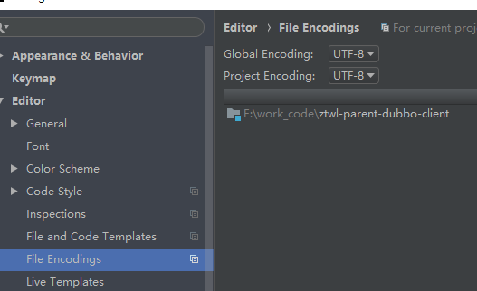
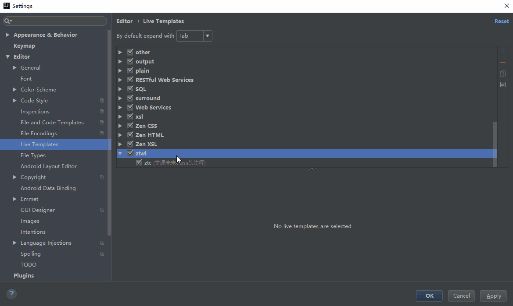
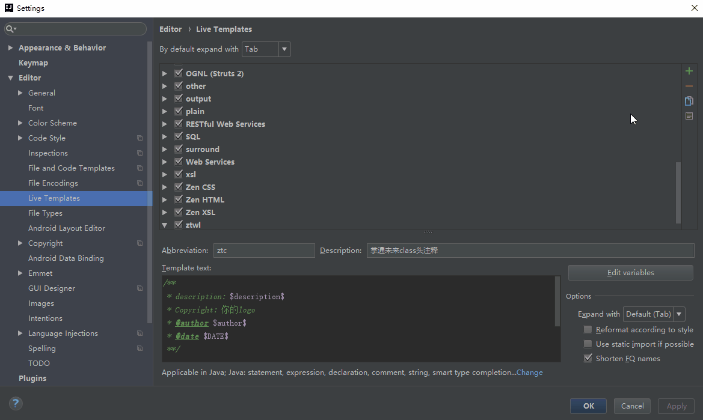
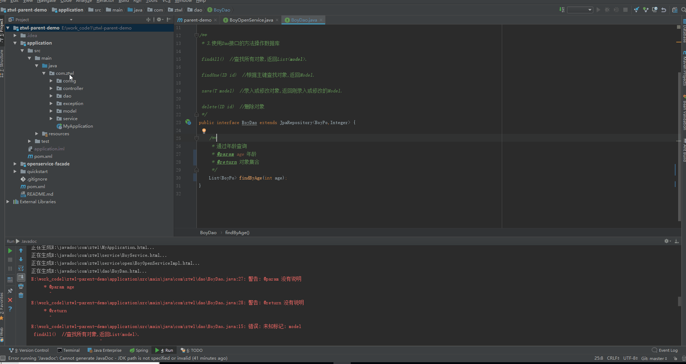
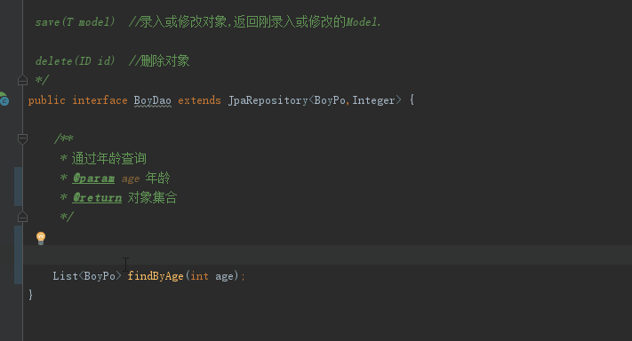

[TOC]
# 配置本地Jdk环境
推荐使用Jdk8，相应下载地址
# IntelliJ IDEA配置
## 1 中文编码配置
Setting->File Encodings->IDE Encoding选择utf-8，不要选择“system default”



## 2 安装配置git
### 2.1 下载安装git
相应下载地址
```
https://git-scm.com/downloads
```
git安装过程略
### 2.2 idea中配置git环境
IDEA中 file--setting--git配置git


点击test 弹出 success 配置成功

## 3 必安装的插件

### 3.1 lombok
#### 3.1.1 安装
IDEA中 file--setting--plugins--browse repositories
搜索 lombok，安装后重启IDE
### 3.1.2 必要的配置
file --setting --Build Execution,Deployment--Annotation Processors 
勾选 Enable annotation processing
### 3.1.3 功能
- @Date注解实体类，可以直接省去添加setter/getter
- @NonNull注解到方法的入参前，可以不用再进行判空处理，直接抛出空指针异常
- @Log4j2注解添加到类上，可以省去log4j2的logger初始化，直接在类里面使用"log.info等"就可以直接进行打印


### 3.2 Alibaba Java Coding Guidelines（阿里编码规约）
#### 3.2.1 安装
file--setting--plugins--browse repositories 搜索 alibaba

选择 Alibaba java Coding GuideLines

安装后重启IDE，可在tools下面找到


## 4 设置注释模板
### 4.1 类注释模板配置和使用
使用IDEA的live templates来进行类注释的配置
file--setting--Editor--Live Templates



添加类头注释模板



```
参考以下模板内容（图片中仅做示例展示使用）

/**
 * <p>Description: $description$</p>
 *
 * <p>Copyright:  2018-2018 北京掌通未来科技有限公司.All rights reserved.</p>
 *
 * @author $author$
 *
 * @date $DATE$
 **/

```

注释添加过程



### 4.2 方法注释
方法注释直接使用IDEA自带的功能即可



