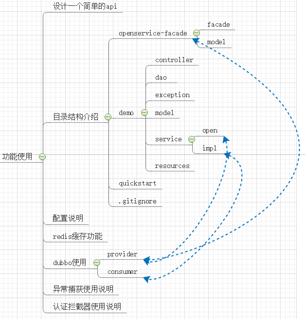

[TOC]
## 1. 开发环境配置
<a href='quickstart/basic_setting.md'>基础开发环境配置</a><br>

## 2. 运行demo项目
### 2.1 获取代码
利用idea可以直接clone代码

 

### 2.2 maven关联


### 2.3 设置使用jdk


### 2.4 通过idea运行


在浏览器中输入http://localhost:8083/hello
返回如下图，说明成功运行


## 3. 编写第一个API
demo中已经存在boy相关的API（相关操作可以参考），下面我们开始编辑一个新的API。
### 3.1 添加数据库配置
数据库操作默认使用jpa+druid连接池，application.yml里做简单配置即可进行数据库的使用
```yml
spring:
  datasource:
    url: jdbc:mysql://172.16.202.40:3306/testdb1?useUnicode=true&characterEncoding=UTF-8&useSSL=false
    username: root
    password: 123456
  jpa:
    hibernate:
      ddl-auto: update
    show-sql: true
```
### 3.1 添加数据库模型和操作方法
在model目录中添加GirlPo.java文件
```java
package com.ztwl.model;
import lombok.Data;

import javax.persistence.Entity;
import javax.persistence.GeneratedValue;
import javax.persistence.Id;
import java.io.Serializable;

/**
 * @author Administrator
 */
@Entity(name = "girl")
@Data
public class GirlPo implements Serializable {
    @Id
    @GeneratedValue
    private Integer id;

    private String name;

    private Integer age;
}
```
在dao目录添加GirlDao.java
```java
package com.ztwl.dao;

import com.ztwl.model.GirlPo;
import org.springframework.data.jpa.repository.JpaRepository;

public interface GirlDao extends JpaRepository<GirlPo,Integer> {
}
```
执行程序，然后发现对应的数据库中自动创建了girl的数据库表


### 3.2 添加Service
在service目录添加GirlService.java
```java
package com.ztwl.service;

import com.ztwl.model.GirlPo;

public interface GirlService {
    /**
     * 增加
     * @param girlPo
     */
    void add(GirlPo girlPo);

    /**
     * 查询一条记录
     * @param id 对应的id
     * @return
     */
    GirlPo findOne(Integer id);
}
```
在service.impl目录添加GirlServiceImpl.java
```java
package com.ztwl.service.impl;

import com.ztwl.dao.GirlDao;
import com.ztwl.model.GirlPo;
import com.ztwl.service.GirlService;
import org.springframework.beans.factory.annotation.Autowired;
import org.springframework.stereotype.Service;

@Service
public class GirlServiceImpl implements GirlService {

    @Autowired
    private GirlDao girlDao;

    @Override
    public void add(GirlPo girlPo) {
        girlDao.save(girlPo);
    }

    @Override
    public GirlPo findOne(Integer id) {
        return girlDao.findOne(id);
    }
}
```

### 3.3 添加Controller
在controller目录添加添加GirlController.java
```java
package com.ztwl.controller;

import com.ztwl.model.GirlPo;
import com.ztwl.service.GirlService;
import org.springframework.beans.factory.annotation.Autowired;
import org.springframework.web.bind.annotation.RequestMapping;
import org.springframework.web.bind.annotation.RestController;

@RestController
@RequestMapping("/girl")
public class GirlController {
    @Autowired
    private GirlService girlService;

    @RequestMapping("/add")
    public void add(String name, int age) {
        GirlPo girl = new GirlPo();
        girl.setName(name);
        girl.setAge(age);
        girlService.add(girl);
    }

    @RequestMapping("/find")
    public Object findOne(int id) {
        return girlService.findOne(id);
    }
}
```
### 3.4 运行程序测试
运行程序，在浏览器中输入
```
http://www.localhost:8083/girl/add?name=wang&age=20
```
观察数据库中的数据变化


在浏览器中输入
```
http://www.localhost:8083/girl/find?id=1
```
得到如下结构


### 3.5 总结
以上是一个简单的API接口实现，parent-demo中已经把相应的目录预留，按照规范的目录开发是必要的。

## 4 目录结构介绍


- openservice-facade 用于暴露rpc接口的工程
    - facade 暴露的接口
    - model 接口中使用的model（可以以Dto）结尾
- demo 业务开发的工程（实际开发中可以用项目名取代，例如growthserver）
    - controller 控制器目录
    - dao 数据访问对象
    - exception 统一异常
    - model 数据模型（Po是持久化对象，Vo是值对象，Dto数据传输对象）
    - service 业务处理
        - open 用于RPC的提供者
        - impl 所有的服务实现（包括内部服务，RPC的消费者服务实现）
    - resources 配置文件目录
        - bootstrap.yml springboot优先配置的文件（优先于application.yml）
        - application.yml springboot启动配置文件
    - quickstart 文档目录
    - git忽略文件

注：
新的openservice-facade项目需注意两点：
- 目录名称保持不变（即openservice-facade）
- maven坐标改成自己的服务名称，例：openservice-facade-growthserver


## 5 配置说明
### 5.1 配置文件目录结构
ztwl-parent-demo中存在不同环境的bootstrap.yml文件：
- bootstrap.yml：默认启动的配置文件，这里只进行了profiles的选择，默认是开启dev
- bootstrap-dev.yml：dev环境配置，关闭spring config，默认走本地application.yml配置文件
- bootstrap-test.yml：测试环境配置
- bootstrap-prod.yml：生产环境配置
- application.yml：开发环境使用的本地配置文件

注：spring boot默认加载配置文件的顺序是：bootstrap.yml -> application.yml
现有两种不同的配置方式：
- 本地配置：直接操作本地application.yml文件，方便开发和调试
- spring config配置：通过操作git仓库中对应的application.yml文件，方便测试环境和生产环境中使用。这种方式依赖spring cloud config分布式配置服务，将在以下介绍其编码、配置和启动。

|   | 本地配置  | spring cloud配置 |
| :------------: | :------------: | :---------:|
| 开发环境 | 是  | 否  |
|  测试环境 | 否  | 是 |
| 生产环境|  否 | 是 |

### 5.1 本地配置（推荐开发环境使用）
在开发过程中，研发人员更希望配置文件能本地化，能方便得去修改各种配置信息（比如用的mysql、redis、消息队列等配置信息）。
使用ztwl-parent-demo，默认关闭spring config，参考bootstrap-dev.yml
```
# enabled为false时，配置文件使用application.xml
spring:
  cloud:
    config:
      enabled: false
```
这种情况下使用本地的application.yml中的配置。
```yml
debug: false            # 关闭debug，减少日志打印
parent:                     
  redis:
    enabled: true       # 打开redis功能的支持

management:
  health:
    redis:
      enabled: false     # 健康监测排除redis（如有特殊需求可以打开）

server:
  port: 8083                # 设置server启动打开的端口

spring:
  datasource:               # 设置sql数据源信息
    url: jdbc:mysql://172.16.202.40:3306/testdb1?useUnicode=true&characterEncoding=UTF-8&useSSL=false
    username: root
    password: 123456
  jpa:                              # 设置jpa
    hibernate:
      ddl-auto: update
    show-sql: true

  redis:                            # 设置redis环境
    host: 172.16.202.40
    port: 6379
    database: 8
    password:

  dubbo:                        # 设置duboo环境
    appname: parent-demo-zjx
    registry: zookeeper://172.16.202.33:2181?backup=172.16.202.40:2181
    protocol: dubbo

  rabbitmq:                     # 设置rabiitmq环境
    virtual-host: /
    addresses: 172.16.202.40:5672
    host: 172.16.202.40
    port: 5672
    username: zhangjiaxing
    password: 123456
    queue: queue1
    exchange: fanout-test
```
### 5.2 spring config配置（测试和生产环境使用）
测试环境和生产环境下，使用命令行运行加入如下参数，即可选择对应环境的配置文件
```
# 激活test配置文件
nohup java -jar xx.jar --spring.profiles.active=test > /dev/null & 
# 激活prod配置文件
nohup java -jar xx.jar --spring.profiles.active=prod > /dev/null &
```
test、prod是依赖spring config的服务进行配置，参考bootstrap-test.yml和bootstrap-prod.yml
```yml
spring:
  cloud:
    config:
      uri: http://外网地址:8091/
      name: test-application
      profile: prod
      label: master
```

### 5.3 config server介绍


- config server：提供更新配置服务
- git，用于保存配置文件，注意，当git出现push更新的操作，会通知config server，进而通知到web server重新拉取配置
- web server启动以后，会通过配置中心拉取git上的配置文件

## 6 redis缓存功能
### 6.1 redis缓存功能开关
ztwl-parent-demo默认打开redis功能（如果想关闭功能，可设置enabled: false）
```
parent:
    redis:
        enabled: true
spring:
    redis:
        host: 172.16.202.40
        port: 6379
        database: 8
        password:
```
### 6.2 缓存功能简单应用
开启缓存功能只需添加注解@Cacheable
```
    @Override
    @Cacheable(value = "usercache", key = "'selectUserById:id_'+#id")
    public BoyPo findOne(Integer id) {
        return boyDao.findOne(id);
    }
```
第一次访问之后，即可看到redis中缓存了相应的数据


## 7 dubbo微服务框架
现有版本使用的微服务框架是dubbo（将来可以考虑更换成为spring cloud）
- 提供者，与openservice-facade-xxx和service.open目录相关
- 消费者，在service.impl目录中去实现



### 7.1 提供者实现
提供者接口定义在openservice-facade-xxx中，例如BoyOpenService.java
```
package com.ztwl.facade;

import com.ztwl.model.Words;

public interface BoyOpenService {
    Words sayHello();
}

```
接口中相关的model为，Words.java
```
package com.ztwl.model;

import lombok.Data;

import java.io.Serializable;

/**
 * @author Administrator
 */

@Data
public class Words implements Serializable {
    private String first;

    private String second;
}

```

下面是消费者的实现部分，BoyOpenServiceImpl.java。@Service注解的类，即可被注册到dubbo中进行服务发现
```
package com.ztwl.service.open;

import com.alibaba.dubbo.config.annotation.Service;
import com.ztwl.facade.BoyOpenService;
import com.ztwl.model.Words;
import org.springframework.context.annotation.Scope;
import org.springframework.stereotype.Component;

/**
 * @author Administrator
 */
@Service(interfaceClass = BoyOpenService.class,version = "1.0.0")
@Component
public class BoyOpenServiceImpl implements BoyOpenService {
    @Override
    public Words sayHello() {
        Words words = new Words();
        words.setFirst("hello");
        words.setSecond("world");
        return words;
    }
}

```
运行程序，查看dubbo-admin，发现接口已经注册成功。

### 7.2 消费者
消费者的使用比较简单（可直接参考http://gitlab.szy.net/wangtonggui/dubbo-consumer.git）
```
    // 在属性上使用此注解，即可自动注入远程service对象（版本可选）
    @Reference(version = "1.0.0")
    BoyOpenService boyOpenService;
```

## 8 全局异常以及response使用说明
### 8.1 API的response结构
API需要response统一的数据结构，方便客户端处理。
```
{
    "code":1000,
    "message":"这里是response的数据说明",
    "body":{
        "id":10,
        "name":"wang",
        "age":10
        }
}
```
可以使用你以下方法来生成response
```
public static ResultBody successBody()
public static ResultBody errorBody(Object resultEnum)
```
### 8.2 统一异常处理的使用
在WEB API的使用过程中，除去调用正常的情况，其他都可以称之为异常。
#### 8.2.1 异常定义
异常分为两类：
- 通用异常（业务无关），例如404（web接口不存在），500（服务器内部错误），未知错误等。
    - `server编程不需要考虑通用异常处理，parent已经全部托管`
- 自定义异常（业务相关），例如调用findOne接口时，传入的id为负数
    - 参考ServerNameException.java 异常类，MyResultEnum.java 业务层自定义异常
    - 注意：`自定义异常必须放置到openservice-facade中，对外公布`


通用异常在ztwl-parent里面已经设置了统一捕获，在编写业务层的时候只需要关心业务相关的异常即可。
在每个业务server里可以实现自己异常处理。

自定义异常类型，ServerNameException.java（类的名称前缀建议使用服务名）：
```
@Data
@EqualsAndHashCode(callSuper = false)
public class ServerNameException extends RuntimeException {
    private ServerNameExceptionEnum exceptionEnum;

    public ServerNameException(ServerNameExceptionEnum exceptionEnum) {
        this.exceptionEnum = exceptionEnum;
    }
}
```

自定义异常枚举ServerNameExceptionEnum.java：
```
public enum ServerNameExceptionEnum {
    /**
     * 测试用，id错误
     */
    BOY_ID_ERROR(1380001, "测试用，id错误"),
    /**
     * 测试用，年龄错误
     */
    BOY_AGE_ERROR(1380002, "测试用，年龄错误");

    private int code;
    private String message;

    ServerNameExceptionEnum(int code, String msg) {
        this.code = code;
        this.message = msg;
    }

    public Integer getCode() {
        return code;
    }

    public String getMessage() {
        return message;
    }

    @Override
    public String toString() {
        return "MyResultEnum{" +
                "code=" + code +
                ", msg='" + message + '\'' +
                '}';
    }
}
```


#### 8.2.2 异常触发
参考BoyController.java
```
@RequestMapping(value = "/test_exception")
	public Object exception() {
	    // 自定义一个非法的id
	    int id = -1;
        return boyService.findOne(id);
    }
```
这里调用boyService.findOne，但是传入的id为一个负数，显然是异常的。在service的参数检测中，会发现参数存在异常，并且抛出来，之后进行统一的处理
```
    @Override
    @Cacheable(value = "usercache", key = "'selectUserById:id_'+#id")
    public BoyPo findOne(Integer id) {
        // 简单校验id
        if (id < 0) {
            throw new ServerNameException(MyResultEnum.BOY_ID_ERROR);
        }
        return boyDao.findOne(id);
    }
```

#### 8.2.3 异常捕获
自定义异常接收和处理，MyExceptionHandler.java（@ControllerAdvice和@ExceptionHandler注解是必须的，这样spring boot会自动进行异常捕获）：
```
@ControllerAdvice
public class MyExceptionHandler {
    /**
     * 捕获自定义的异常实体
     * @param e 异常实体
     * @return response的统一实体
     */
    @ExceptionHandler(ServerNameException.class)
    @ResponseBody
    public ResultBody myException(ServerNameException e) {
        switch (e.getExceptionEnum()) {
            case BOY_ID_ERROR:
            // 业务处理
            default:
        }
        return ResultBody.errorBody(new MyResult(e.getExceptionEnum()));
    }
}
```

## 其他


