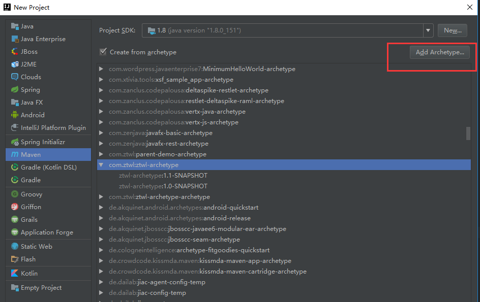

## 生成archetype骨架
进入到项目根目录
```
mvn archetype:create-from-project 生成项目骨架
```

进入到骨架目录进行本地的install

```
cd E:\work_code\ztwl-parent-demo\target\generated-sources\archetype
进入到pom.xml，修改希望设置的坐标（也就是以后在使用骨架生成项目的时候使用的坐标）
mvn install
成功说明生成的骨架没有问题

```

下面deploy我们骨架到maven私服（需要设置distributionManagement）
```
打开pom文件，添加如下distributionManagement

<distributionManagement>
        <repository>
            <id>releases</id>
            <url>http://repo.vi-zone.net/content/repositories/releases</url>
        </repository>
        <snapshotRepository>
            <id>snapshots</id>
            <url>http://repo.vi-zone.net/content/repositories/snapshots</url>
        </snapshotRepository>
</distributionManagement>

退出，执行mvn deploy
```

## idea添加并且自动更新archetype
### 添加



### archetype迭代更新
- 添加自动更新的插件 maven-archetypes-catalog-plugin-1.2.6.zip（本地安装即可，具体步骤略。插件离线包在other目录下）
- 给插件添加自动更新的地址 File -> Settings -> Build, Execution, Deployment -> Build Tools -> Maven Archetype Catalogs. click the '+，然后输入http://repo.vi-zone.net/service/local/repositories/snapshots/content/archetype-catalog.xml


