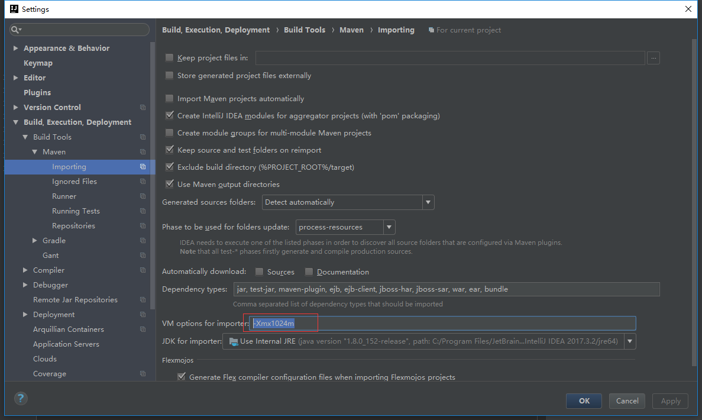
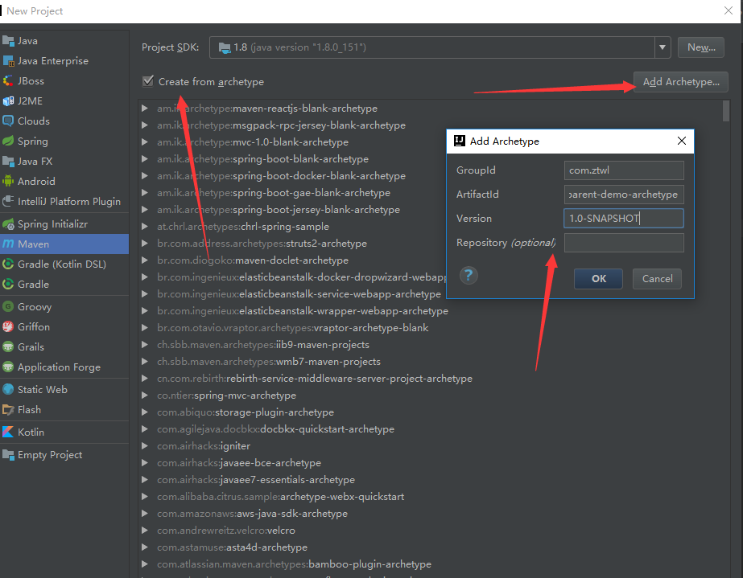
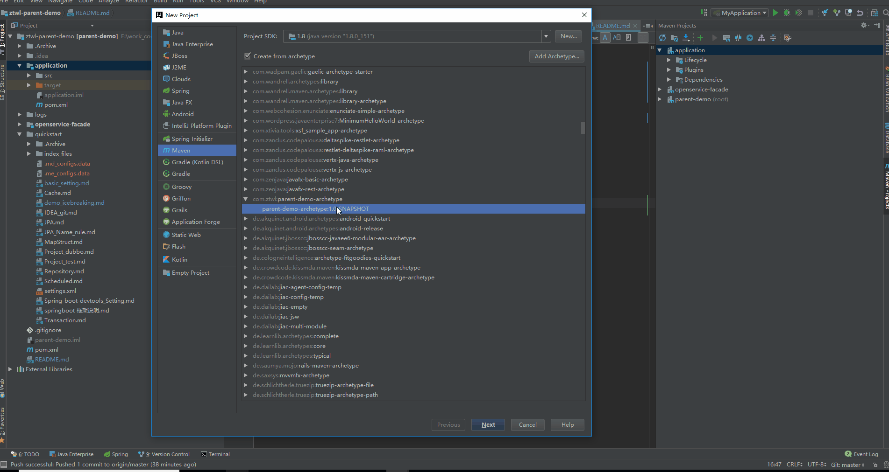
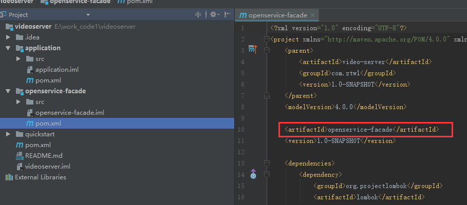
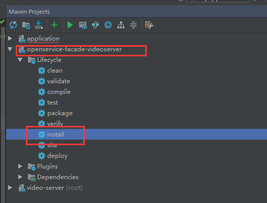
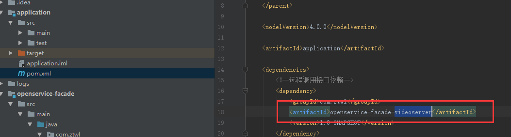
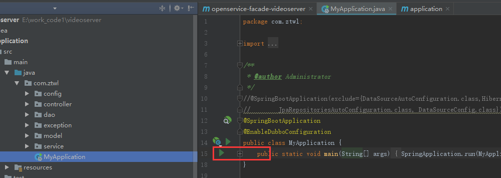

## 通过maven的archetype快速创建项目
### 基本设置
如下设置，解决maven加载太慢的问题


### 模板坐标

```
<groupId>com.ztjy</groupId>
<artifactId>ztjy-archetype</artifactId>
<version>1.0-SNAPSHOT</version>
```
注：version可能会迭代更新
`注： 坐标以此为准，演示图中坐标仅用于演示`

### 创建工程
File--new--project，添加模板坐标。




选择模板，创建工程




### 运行前配置和编译
#### openservice-facade配置和编译
openservice-facade子工程坐标，需手动修改



```
openservice-facade修改成为openservice-facade-videoserver（本项目以video-server为例）
```
执行mvn install把jar包安装到本地仓库，也可通过IDEA执行，如下图



#### application配置和启动
配置application的pom文件，修改对openservice-facade的依赖



```
openservice-facade修改为openservice-facade-videoserver
```

刷新maven，启动application的main



在浏览器中输入
```
http://localhost:8083/hello
```
发现成功运行


## 其他
* <a href='generate_using_archetype.md'>archetype的生成以及版本迭代更新</a><br>


