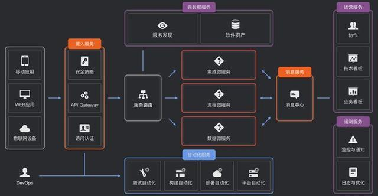
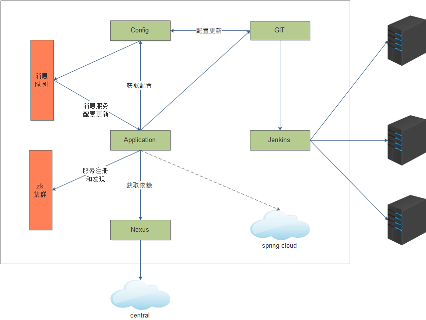
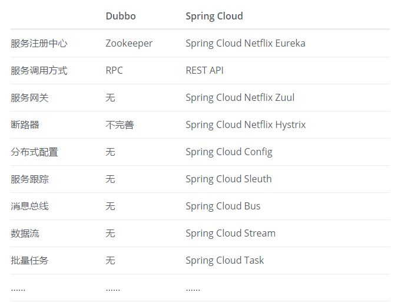
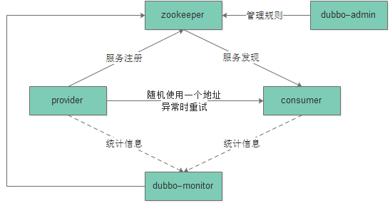
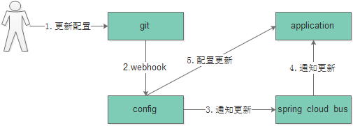
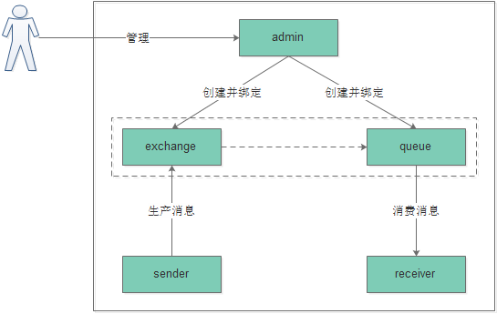

TOC

[TOC]


## 封装的目的

- 统一框架的使用，统一工具和使用方法
- 统一代码开发规范（server名，模块名，文件名，目录结构，配置文件，代码结构，开发环境等）

## 1. 框架介绍

### 1.1. 什么是spring boot

spring boot 设计目的是用来简化新 Spring 应用的初始搭建以及开发过程。该框架使用了特定的方式来进行配置，从而使开发人员不再需要定义样板化的配置。

Spring Boot 简化了基于 Spring 的应用开发，通过少量的代码就能创建一个独立的、产品级别的 Spring 应用。Spring Boot 为 Spring 平台及第三方库提供开箱即用的设置。

Spring Boot 的核心思想就是约定大于配置，多数 Spring Boot 应用只需要很少的 Spring 配置。采用 Spring Boot 可以大大的简化你的开发模式，所有你想集成的常用框架，它都有对应的组件支持。

### 1.2. 框架封装特点

- spring boot框架，零配置
- spring boot框架之上的再封装
- 统一代码开发规范，统一工具使用方式
- demo，有待继续集成和验证
- web开发提供一个类似模板

### 1.3. 集成的功能





**配套服务类**

- spring cloud config
- spring cloud Netflix
- dubbo/edas

**工具类**

- mysql
- redis
- rabbitmq

**功能类**

- RESTful接口
- 统一返回和统一异常
- 过滤器
- 拦截器
- 监听器
- 定时器

### 1.4. 框架服务依赖

| 服务名 | 说明 | 内网地址 | 外网地址 | 备注 |
|--------|------|---------|---------|------|
| zookeeper | dubbo服务注册中心 | 172.16.202.33:2181，172.16.202.40:2181 | | 8088/dubbo-admin,7000 |
| rabbitmq | 消息服务中心，配置中心 | 172.16.202.33:5672，172.16.202.40:5672 | | 15672 |
| git | 内地代码仓库 | 172.16.202.40 | | |
| nexus | 私服 | 172.16.202.40:8081 | | |
| jenkins | 自动化部署 | 172.16.202.40:8088 | | 自定义脚本 |

## 2. 代码介绍

### 2.1. 代码地址

[ztwl-parent](http://gitlab.szy.net/refactor/ztwl-parent.git)

[ztwl-parent-demo](http://gitlab.szy.net/refactor/ztwl-parent-demo.git)

### 2.2. ztwl-parent代码结构

自定义starter的方式封装parent，通过配置控制工具beans的加载。

```
├── log
├── pom.xml
├── README.md
├── src
│   └── main
│       ├── java
│       │   └── com
│       │       └── ztwl
│       │           ├── common
│       │           │   ├── exception
│       │           │   │   └── GlobalExceptionHandler.java
│       │           │   ├── interceptor
│       │           │   │   └── AccessTokenVerifyInterceptor.java
│       │           │   ├── response
│       │           │   │   ├── ResultBody.java
│       │           │   │   └── ResultEnum.java
│       │           │   ├── service
│       │           │   │   └── ValidationService.java
│       │           │   └── utils
│       │           │       ├── RabbitmqReceiver.java
│       │           │       ├── RabbitmqSender.java
│       │           │       └── RedisUtils.java
│       │           ├── datasource
│       │           │   ├── DataSourceConfig.java
│       │           │   └── DataSourceProperties.java
│       │           ├── rabbitmq
│       │           │   ├── RabbitmqConfig.java
│       │           │   └── RabbitmqProperties.java
│       │           ├── redis
│       │           │   ├── RedisConfig.java
│       │           │   └── RedisProperties.java
│       │           └── TestReload.java
│       └── resources
│           └── META-INF
│               └── spring.factories
```

### 2.3. parent-demo代码结构

引用parent，专注业务层功能。

```
├── demo
│   ├── demo.iml
│   ├── pom.xml
│   ├── src
│   │   ├── main
│   │   │   ├── java
│   │   │   │   └── com
│   │   │   │       └── ztwl
│   │   │   │           ├── config
│   │   │   │           │   └── WebMvcConfig.java
│   │   │   │           ├── controller
│   │   │   │           │   ├── BoyController.java
│   │   │   │           │   ├── GirlController.java
│   │   │   │           │   └── HelloController.java
│   │   │   │           ├── dao
│   │   │   │           │   └── BoyDao.java
│   │   │   │           ├── exception
│   │   │   │           │   ├── MyExceptionHandler.java
│   │   │   │           │   ├── MyException.java
│   │   │   │           │   └── MyResultEnum.java
│   │   │   │           ├── model
│   │   │   │           │   ├── BoyDto.java
│   │   │   │           │   ├── BoyPo.java
│   │   │   │           │   ├── BoyVo.java
│   │   │   │           │   └── mapper
│   │   │   │           │       └── BoyMapper.java
│   │   │   │           ├── service
│   │   │   │           │   ├── BoyService.java
│   │   │   │           │   ├── impl
│   │   │   │           │   │   ├── BoyServiceImpl.java
│   │   │   │           │   │   └── RabbitmqServiceImpl.java
│   │   │   │           │   └── open
│   │   │   │           │       └── BoyOpenServiceImpl.java
│   │   │   │           └── TestApplication.java
│   │   │   └── resources
│   │   │       ├── application.yml
│   │   │       ├── bootstrap-dev.yml
│   │   │       ├── bootstrap-prod.yml
│   │   │       ├── bootstrap-test.yml
│   │   │       ├── bootstrap.yml
│   │   │       └── log4j2.xml
│   │   └── test
│   │       ├── ControllerTest.java
│   │       └── ServerTest.java
├── logs
│   ├── application-default.yml
│   └── test-application
│       ├── error.log
│       ├── info.log
│       └── warn.log
├── openservice-facade
│   ├── openservice-facade.iml
│   ├── pom.xml
│   ├── src
│   │   └── main
│   │       └── java
│   │           └── com
│   │               └── ztwl
│   │                   ├── facade
│   │                   │   └── BoyOpenService.java
│   │                   └── model
│   │                       └── Words.java
├── pom.xml
├── quickstart
└── README.md
```

## 3. 框架基本功能介绍

### 3.1. RPC服务框架dubbo

目前框架中选用dubbo作为RPC框架，主要是为兼容考虑，将来逐渐切换到spring cloud。

- 背景：alibaba,Spring (Pivotal Netflix)
- 社区活跃：
- 完整度：
- RPC和REST ful：RPC强代码依赖，RESTful 更轻量级，更灵活
- 文档：

[微服务架构的基础框架选择：Spring Cloud还是Dubbo？](https://zhuanlan.zhihu.com/p/25450681)
[放弃 Dubbo，选择最流行的 Spring Cloud 微服务架构实践与经验总结](https://cloud.tencent.com/developer/article/1006177)

#### 3.1.1. 基本原理



Dubbo缺省协议采用单一长连接和NIO异步通讯，适合于小数据量大并发的服务调用。

- 服务提供者启动时注册服务
- 服务消费者启动时订阅服务列表
- 注册中心在服务列表发生变化时通知消费者
- 消费者获取提供者的服务，随机使用一个地址，当出现异常时重新尝试下一个
- monitor以服务提供者的方式提供服务，provider和consumer定时上报统计信息
- admin将路由规则添加到zookeeper中，zookeeper信息一旦发生改变，会通知Consumer接受数据；同时admin获得zookeeper上的provider和consumer信息进行管理

#### 3.1.2. pom依赖

```xml
<dependency>
    <groupId>com.alibaba.spring.boot</groupId>
    <artifactId>dubbo-spring-boot-starter</artifactId>
    <version>2.0.0</version>
</dependency>
```

alibaba官方starter，集成dubbo2.6.0。

#### 3.1.3. 配置文件使用

配置文件对应的是application.yml对应的配置文件，本文档中不加说明则默认指的是application.yml相关的配置文件。

```yml
spring:
  dubbo:
    appname: parent-demo
    registry: zookeeper://172.16.202.33:2181?backup=172.16.202.40:2181
    protocol: dubbo
```
- appname：本服务的名称，和应用同名
- registry：注册中心地址，默认使用zookeeper作为dubbo服务注册中心。
- protocol：协议名称，默认为dubbo

#### 3.1.4. 服务提供者

**启动dubbo**

在Spring Boot Application的上添加@EnableDubboConfiguration, 表示要开启dubbo功能
```java
@SpringBootApplication
@EnableDubboConfiguration
public class DemoApplication {
  //...
}
```

**编写提供者**

编写你的dubbo服务,只需要添加要发布的服务实现上添加@Service（import com.alibaba.dubbo.config.annotation.Service）注解 ,其中interfaceClass是要发布服务的接口，同时可以设置接口版本等参数。接口定义需要单独在openservice-facade中定义。
```java
@Service(interfaceClass = BoyOpenService.class,version = "1.0.0")
@Component
public class BoyOpenServiceImpl implements BoyOpenService {
//...
}
```

#### 3.1.5. 服务消费者

**启用dubbo**

同上

**引用接口jar包**

```java
<dependency>
    <groupId>com.ztwl</groupId>
    <artifactId>openservice-facade</artifactId>
    <version>1.0-SNAPSHOT</version>
</dependency>
```

接口对应的jar包统一由提供者提供并上传到私服，消费者通过pom引用jar包即可。

**编写消费者**

通过@Reference注入需要使用的interface.

```java
@Component
public class HelloConsumer {
  @Reference
  private BoyOpenService boyOpenService;
}
```

### 3.2. 全局统一配置spring cloud config

配置更新采用消息总线方式，消息队列使用rabbitmq。

#### 3.2.1. 基本原理



1. 更新git中心配置信息
2. 通过webhook通过配置中心刷新配置
3. 配置中心收到请求并发送给Spring Cloud Bus
4. Spring Cloud bus接到消息并通知给应用客户端
5. 客户端接收到通知，请求Server端获取最新配置

#### 3.2.2. pom依赖

```xml
<dependency>
    <groupId>org.springframework.cloud</groupId>
    <artifactId>spring-cloud-starter-config</artifactId>
</dependency>
```

#### 3.2.3. 配置文件使用

这里对应的是bootstap.yml相关的配置文件。

```yml
spring:
  cloud:
    config:
      uri: http://172.16.202.40:8091/
      name: demo-application
      profile: test
      label: master
```

- uri：config服务对应的地址
- name：本服务名称，需要通过名称拉去配置文件
- profile：当前使用的配置文件的环境
- label：配置文件所谓的git分支

以上配置对应的配置文件地址则为：http://git.com/demo-application-test.yml

#### 3.2.4. 配置动态更新

通过@RefreshScope动态刷新配置文件

```java
@RefreshScope
@RestController
class HelloController {

    @Value("${girl.name}")
    private String name;

    @Value("${girl.age}")
    private String age;

    //...
}
```

#### 3.2.5. webhok配置

略

### 3.3. 消息服务rabbitmq

[几款消息中间的调研](http://blog.wentong.me/2016/01/message-queue-research/)

总结：

| 队列名 | 优点 | 缺点 |
|--------|-----|------|
| kafka | 批处理，高吞吐，可回溯 | 运维工具一般 |
| RabbitMQ | 多语言api,性能优秀，实时 | 重量级消息系统 |
| ONS/RoccketMQ | 事务，可回溯 | 不保证至少消费一次，不保证有序 |
| MNS | RESTful api | 不支持有序 |

#### 3.3.1. 基本架构



1. broker架构模式
2. 管理人员通过后台添加exchange和queue，同时配置绑定关系，二者是多对多的关系
3. 消息发送方sender换机exchange
4. 消息接收方receiver通过queue获得消息

#### 3.3.2. pom依赖

```xml
<dependency>
    <groupId>com.alibaba.spring.boot</groupId>
    <artifactId>dubbo-spring-boot-starter</artifactId>
    <version>1.0.0</version>
</dependency>
```

#### 3.3.3. 配置文件使用

```yml
spring:
  rabbitmq:
    virtual-host: /
    addresses： 172.16.202.40:5672
    host: 172.16.202.40
    port: 5672
    username: zhangjiaxing
    password: 123456
    queue: queue1
    exchange: fanout-test
```

- virtual-host：消息队列的虚拟主机名，权限管理使用
- addresses：消息队列的多个地址
- host：消息队列host
- port：消息队列端口
- username：对应拥有vh的用户名
- password：用户名对应密码
- queue：消费者使用的队列名
- exchange：生产者使用的交换机名

#### 3.3.4. 生产者

注入RabbitmqSender发送者，调用RabbitmqSender的sendMessage方法即可。

```java
@Service
public class RabbitmqServiceImpl {

    @Autowired
    private RabbitmqSender rabbitmqSender;

    @Value(("${spring.rabbitmq.exchange}"))
    private String exchangeName;

    public void sendMessage(Object object) {
        rabbitmqSender.sendMessage(exchangeName, object.toString());
        logger.info("send message " + object.toString() + " to exchange: " + exchangeName);
    }
}
```

#### 3.3.5. 消费者

继承RabbitmqReceiver类，实现processMessage方法即可。

```java
@Service
public class RabbitmqServiceImpl implements RabbitmqReceiver {

    @Override
    public Boolean processMessage(byte[] body) {
        return false;
    }
}
```

### 3.4. 数据库服务mysql

数据库目前采用spring-boot自带的jpa，同时使用druid数据库连接池。

#### 3.4.1. pom依赖

```xml
<dependency>
    <groupId>org.springframework.boot</groupId>
    <artifactId>spring-boot-starter-data-jpa</artifactId>
</dependency>
<dependency>
    <groupId>mysql</groupId>
    <artifactId>mysql-connector-java</artifactId>
</dependency>
<dependency>
    <groupId>com.alibaba</groupId>
    <artifactId>druid</artifactId>
    <version>1.1.0</version>
</dependency>
```

#### 3.4.2. 配置文件使用

```yml
spring:
  datasource:
    url: jdbc:mysql://172.16.202.40:3306/testdb1?useUnicode=true&characterEncoding=UTF-8&useSSL=false
    username: root
    password: 123456
    dbtype: mysql
    driver-class-name: com.mysql.jdbc.Driver
  jpa:
    hibernate:
      ddl-auto: update
    show-sql: true
```

#### 3.4.3. 代码使用

方法一：ORM

```java
@Entity(name = "boy")
@Data
public class BoyPo implements Serializable {
    @Id // 主键
    @GeneratedValue // 主键生成策略
    private Integer id;
    private String name;
    private int age;
}
```

```java
public interface BoyDao extends JpaRepository<BoyPo,Integer> {

}
```

方法二：JdbcTemplate
```
public class JdbcUtils {
    @Autowired
    private JdbcTemplate jdbcTemplate;

    // ...
}
```

### 3.5. 缓存服务redis

#### 3.5.1. pom依赖

```xml
<dependency>
    <groupId>org.springframework.data</groupId>
    <artifactId>spring-data-redis</artifactId>
</dependency>
<dependency>
    <groupId>redis.clients</groupId>
    <artifactId>jedis</artifactId>
</dependency>
```

#### 3.5.2. 配置文件使用

```yml
spring:
  redis:
    host: 172.16.202.33
    port: 6379
    database: 8
    password:
```

#### 3.5.3. 缓存使用

方法一：注解方式

@Cacheable注解修复的方法都会自动缓存，缓存key为字符串序列化，value为json格式序列化。

```java
@Cacheable(value = "usercache", key = "'selectUserById:id_'+#id")
@RequestMapping("/boy/findOne/{id}")
public Boy findOne(@PathVariable(name = "id") Integer id){
    return boyService.findOne(id);
}
```

@CachePut
@CacheEvict

方法二：RedisTemplate

```
public class RedisUtils {
    @Autowired(required = false)
    private RedisTemplate<String, Object> redisTemplate;

    // ...
}
```

### 3.6. 日志服务log4j2

#### 3.6.1. pom依赖

```xml
<dependency>
    <groupId>org.springframework.boot</groupId>
    <artifactId>spring-boot-starter-log4j2</artifactId>
</dependency>
```

#### 3.6.2. 配置文件使用

- resources/log4j2.xml

#### 3.6.3. 代码使用

略

### 3.7. 全局异常处理

- 主要用户统一管理返回结果和异常处理
- 全局统一异常，引用层异常

```json
{
    "code":1000,
    "message":"这里是response的数据说明",
    "body":{
        "id":10,
        "name":"wang",
        "age":10
        }
}
```

### 3.8. 过滤器

暂未使用

### 3.9. 拦截器

自定义拦截器，主要用于统一的权限认证管理，日志服务等。

### 3.10. 监听器

暂未使用（启动后载入,session监听等）

### 3.11. 定时器

暂未使用（定时任务）

### 3.12. 配置文件

- resources/applicaton.yml：研发人员本地使用
- resources/bootstrap.yml：控制配置文件
- resources/bootstrap-dev.yml：研发人员配置中心配置，为空时使用本地配置
- resources/bootstrap-prod.yml：生产环境配置中心配置
- resources/bootstrap-test.yml：测试环境配置中心配置

## 4. Jenkins


## 5. 集成计划

**spring cloud**

**工具类**

- MNS
- ES
- mongodb
- 多数据源
- memcache